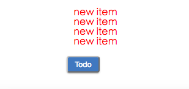

# react-flux-demo
An learning demo that is flux application architecture.

## Quick Start
```bash
$ git clone https://github.com/ipluser/react-flux-demo.git
$ cd react-flux-demo
$ npm start
```

The browser will auto to open a new tab(if not, please visit `http://127.0.0.1:8080`):



## Core Concepts
Flux applications have four major parts: the dispatcher, the stores, the views, and the actions. 

| Name | Description |
|:-----|:------------|
| views | React components |
| Actions | Behavior and action of Views, e.g. `click event` |
| Dispatcher | Register actions, receive actions and calling callback of data flow |
| Stores | Managing the Application's state and broadcast an event declaring for Views that their state has changed |


A unidirectional data flow is central to the Flux pattern. The dispatcher, stores and views are independent nodes with distinct inputs and outputs. The actions are simple objects containing the new data and an identifying type property.

## Demo Explaination
### Views
Open the entry file ***main.jsx***:

```js
// public/scripts/main.jsx
import React from 'react';
import ReactDOM from 'react-dom';
import TodoController from './components/todoController.jsx';

ReactDOM.render(<TodoController />, document.body);
```

The above code use [ReactJS Controller View Pattern](http://blog.andrewray.me/the-reactjs-controller-view-pattern/)，a "controller view" is a top level component that holds all state and passes it to children as props. Let's see ***todoController.jsx***:

```js
// public/scripts/components/todoController.jsx
import React from 'react';

import TodoAction from '../actions/todoAction.js';
import TodoStore from '../stores/todoStore.js';
import Todo from './todo.jsx';

export default class TodoController extends React.Component {
  constructor(props) {
    super(props);
  }

  newItem() {
    TodoAction.addItem('new item');
  }

  render() {
    return <Todo newItem={this.newItem} />;
  }
}
```

In above code, the **TodoController** just assign action for **Todo** component. The **Todo** receive props and render:

```js
// public/scripts/components/todo.jsx
import React from 'react';

import '../../styles/components/todo.scss';

export default function Todo(props) {
  let list = props.items.map((item, index) => {
    return <li className="color--red" key={index}>{item}</li>;
  });

  return (
    <div className="todo">
      <ul>{list}</ul>
      <button className="todo__click-btn" onClick={props.newItem}>Todo</button>
    </div>
  );
}
```

Once click **todo** button, The **TodoController** will trigger an **addItem** action.

## Actions
The **TodoAction** carry data and *actionType* property to **Dispatcher** for dipatch data flow:

```js
// public/scripts/actions/todoAction.js
import AppDispatcher from '../dispatcher.js';
import TodoConstant from '../constants/todoConstant.js';

class TodoAction {
  addItem(text) {
    AppDispatcher.dispatch({
      actionType: TodoConstant.ADD_ITEM,
      text
    });
  }
}

export default new TodoAction();
```

The **todoConstant.js** is constant object that includes all actionType:

```js
// public/scripts/constants/todoConstant.js
export default {
  ADD_ITEM: 'TODO_ADD_ITEM'
};
```

## Dispatcher
The **Dispatcher** is the central hub that manages all data flow in a Flux application. Each **Store** registers itself and provides a callback:

```js
// public/scripts/dispatcher.js
import { Dispatcher } from 'flux';

import TodoStore from './stores/todoStore';
import TodoConstant from './constants/todoConstant';

const AppDispatcher = new Dispatcher();

TodoStore.dispatchToken = AppDispatcher.register(payload => {
  switch (payload.actionType) {
    case TodoConstant.ADD_ITEM:
      TodoStore.addItem(payload.text);
      break;
    default:
  }
});

export default AppDispatcher;
```

In the above code, when **TodoAction** provides the dispatcher with a new action, the **TodoStore** receive the action via the callbacks in the registry.

## Stores
The **TodoStore** contains state and logic. their role is somewhat similar to a *model* in a traditional MVC:

```js
// public/scripts/stores/todoStore.js
import EventEmitter from 'events';

class TodoStore extends EventEmitter {
  constructor() {
    super();
    this.items = [];
  }

  getAll() {
    return this.items;
  }

  addItem(text) {
    this.items.push(text);
    this.change();
  }

  change() {
    this.emit('change');
  }

  addListener(name, callback) {
    this.on(name, callback);
  }

  removeListener(name, callback) {
    this.removeListener(name, callback);
  }
}

export default new TodoStore();
```

In the above code, **TodoStore** will emit an event to the **Views** when the state is changed.

## Views, again
Back to **TodoController**, let it initialize application's state and listen the Store's change event:

```js
// public/scripts/components/todoController.jsx
import React from 'react';

import TodoAction from '../actions/todoAction.js';
import TodoStore from '../stores/todoStore.js';
import Todo from './todo.jsx';

export default class TodoController extends React.Component {
  constructor(props) {
    super(props);
    this.state = { items: TodoStore.getAll() };
    this.onListChange = this.onListChange.bind(this);
  }

  componentDidMount() {
    TodoStore.addListener('change', this.onListChange);
  }

  componentWillUnmount() {
    TodoStore.removeListener('change', this.onListChange);
  }

  onListChange() {
    this.setState({
      items: TodoStore.getAll()
    });
  }

  newItem() {
    TodoAction.addItem('new item');
  }

  render() {
    return <Todo items={this.state.items} newItem={this.newItem} />;
  }
}
```

Once the **TodoController** receive the state is changed, then it will trigger **Todo** to re-render.

## References
- [Facebook Flux](https://facebook.github.io/flux/docs/overview.html)
- [ReactJS Controller View Pattern](http://blog.andrewray.me/the-reactjs-controller-view-pattern/)
- [ruanyf - Flux Guide](http://www.ruanyifeng.com/blog/2016/01/flux.html)

## LICENSE
[MIT](LICENSE)
